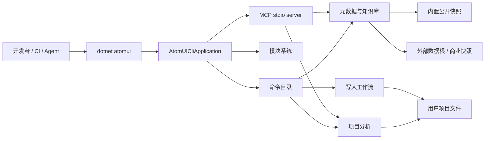
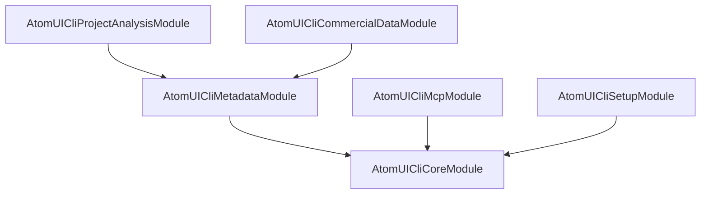

# AtomUI Cli 架构设计文档

## 1. 文档定位

本文档描述 AtomUI Cli 的整体功能架构：它解决什么问题、由哪些能力模块组成、模块之间如何协作、运行时如何管理命令和模块生命周期，以及数据、错误、MCP 和写入能力的边界。

本文档不描述仓库目录、构建文件拆分、发布流水线或工程执行清单。这些内容属于工程实施计划，放在 `docs/superpowers/plans/` 下维护。

## 2. 产品定位

AtomUI Cli 是面向 AtomUI 生态的 .NET Tool。用户安装后通过 `dotnet atomui ...` 调用，用于查询 AtomUI 控件知识、分析项目使用情况、辅助迁移、生成 Agent 可消费的结构化信息，并为 MCP 集成提供稳定入口。

AtomUI Cli 不是应用脚手架，也不是 AtomUI 运行时库。它的核心价值是把 AtomUI 生态的包信息、控件 API、Token、文档、示例、变更记录、项目诊断和商业控件数据组织成本地、稳定、可脚本化的命令行能力。

## 3. 架构目标

- 提供面向人和 Agent 的统一命令入口。
- 将 AtomUI 生态知识沉淀为可版本化、可校验、可离线读取的数据快照。
- 通过项目分析能力识别包引用、注册入口、XAML 命名空间、控件使用、版本兼容、AOT/trimming 风险和迁移问题。
- 支持 AtomUI 核心包、扩展包和商业控件包，并保持公开数据与商业数据边界清晰。
- 使用 GenericHost 作为应用级宿主，统一 DI、配置、日志、生命周期和长驻 MCP 模式。
- 使用 AtomUI.Modularity 管理 CLI 功能模块的身份、依赖、生命周期和贡献点。
- 保持 AOT-first：命令、模块、MCP tool、JSON DTO 和数据索引都必须显式注册或生成，避免运行时扫描和动态加载。
- 输出协议稳定：stdout 只承载命令结果，stderr 承载错误和诊断，错误码、退出码和 JSON envelope 可被脚本依赖。

## 4. 非目标

- 不替代 `dotnet new` 模板系统。
- 不在基础查询命令中访问网络。
- 不在运行时加载或执行用户项目程序集。
- 不通过运行时反射推断控件 API、Token 或 semantic parts。
- 不在未显式确认的情况下修改用户项目。
- 不把商业包内部私有 API 写入公开快照。
- 不通过程序集扫描发现命令、MCP tools、诊断规则或产品扩展。
- 不把应用级 DI 容器暴露为业务层 service locator。
- 不在 Native AOT 工具中动态加载外部模块程序集。

## 5. 系统上下文



AtomUI Cli 运行时围绕一个应用编排器展开。应用编排器负责读取轻量命令 manifest，预解析用户输入，计算本次运行需要激活的模块集合，然后创建模块宿主和 GenericHost，收集 active modules 贡献的命令、MCP tools、数据根和诊断规则，最后执行一次命令或启动 MCP 长驻服务。

## 6. 功能模块总览

| 模块 | 阶段 | 核心职责 |
| --- | --- | --- |
| Core Runtime | P0 | 应用启动、GenericHost 集成、模块生命周期、命令 catalog、命令解析、命令调度、输出、错误码和退出码。 |
| Metadata & Knowledge | P0 | 加载内置和外部元数据快照，提供控件、包、文档、示例、Token、semantic parts、设计文档和变更记录查询。 |
| Project Analysis | P1 | 读取用户项目，构建包引用和源码使用模型，执行诊断规则，输出环境、doctor、usage、lint 和迁移分析结果。 |
| MCP Integration | P1 | 将只读知识查询和项目分析能力暴露为 MCP tools，支持 Agent 通过 stdio 稳定调用。 |
| Setup & Write Workflows | P2 | 管理 setup、init、add、upgrade 等写入类命令，提供 dry-run、写入计划、冲突检查和显式写入确认。 |
| Commercial Data | P2 | 加载商业产品数据根，管理商业快照可见性、授权状态提示和商业控件查询能力。 |

模块之间通过明确的服务契约和贡献点协作。命令和 MCP tools 只是适配层，业务逻辑归属到 Metadata、Project Analysis、Setup 或 Commercial Data 模块。

## 7. Core Runtime 模块

Core Runtime 是 CLI 的应用底座，负责把命令行进程组织成一个可管理的应用生命周期。

核心对象：

| 对象 | 职责 |
| --- | --- |
| `Program.Main` | 只负责创建 `AtomUICliApplication` 并返回退出码。 |
| `AtomUICliApplication` | 应用编排器，拥有 `CommandManifestCatalog`、`ModuleActivationPlan`、`ModuleHost`、`IHost`、冻结后的 command catalog、MCP tool catalog 和诊断规则 catalog。 |
| `AtomUICliApplicationBuilder` | 组合启动参数、Host 配置、模块 registration、命令 manifest、模块启用选项和数据根选项。 |
| `CommandPreParser` | 在模块生命周期前识别命令名、help/version shortcut 和可预校验的全局选项。 |
| `CommandManifestCatalog` | 保存所有命令的轻量 manifest，包括所属模块和命令级 required modules，不创建模块、不注册服务、不加载数据。 |
| `ModuleActivationPlanner` | 根据命令所属模块、命令级 required modules 和硬模块依赖计算 active modules。 |
| `CliCommandDescriptorCatalog` | 保存所有显式注册的命令描述，不扫描程序集。 |
| `CliCommandDispatcher` | 为每次命令执行创建 DI scope，解析 handler，写出结果并映射退出码。 |
| `IOutputWriter` / `IErrorWriter` | 分离 stdout 与 stderr，并支持 text、json、markdown 输出。 |
| `IExitCodeMapper` | 根据 `AtomUICliResult`、错误码和诊断 severity 统一计算退出码。 |

Core Runtime 只承载通用运行时能力，不持有控件知识、项目扫描逻辑或商业数据规则。

## 8. 生命周期设计

生命周期设计是 AtomUI Cli 的运行时主轴。`AtomUICliApplication` 是唯一的生命周期编排器，它同时管理 AtomUI.Modularity 的 `ModuleHost` 和 .NET 的 `IHost`，并保证模块钩子、CLI 专属贡献点、命令执行、MCP 长驻服务和资源释放按固定顺序发生。

### 8.1 生命周期角色

| 角色 | 生命周期职责 |
| --- | --- |
| `Program.Main` | 只负责创建 `AtomUICliApplication`、调用 `RunAsync`、返回退出码。它不直接解析模块、不创建业务服务、不调度命令。 |
| `AtomUICliApplicationBuilder` | 收集启动参数、模块 registration、命令 manifest、activation plan 输入、Host 配置和额外服务注册。Builder 不启动模块。 |
| `AtomUICliApplication` | 生命周期总控。创建 `ModuleHost`，执行模块通用钩子和 CLI 专属钩子，构建 GenericHost，启动命令或 MCP server，并负责停止和释放。 |
| `ModuleHost` | 负责模块拓扑、模块实例创建、服务描述收集、服务冻结、模块初始化和模块关闭。 |
| `IHost` | 负责应用级 DI provider、配置、日志、host lifetime、取消信号和 hosted service 生命周期。 |
| Command / MCP scope | 负责隔离一次命令执行或一次 MCP tool invocation 的短生命周期状态。 |

`ModuleHost` 和 `IHost` 的边界必须清晰：模块系统描述能力和服务，GenericHost 承载运行时 DI 和应用生命周期。任何业务模块都不能绕过 `AtomUICliApplication` 直接启动、停止或重新运行模块阶段。

### 8.2 状态机

`AtomUICliApplication` 使用显式状态机组织启动和退出：

```text
Created
  -> CommandPreParsing
  -> ModuleActivationPlanning
  -> ActiveModulesResolving
  -> ActiveModulesCreating
  -> ActiveModuleServicesConfiguring
  -> ActiveModuleServicesFrozen
  -> ActiveCliContributionsConfiguring
  -> ActiveCliCatalogsFrozen
  -> HostBuilding
  -> ActiveModulesInitializing
  -> HostStarting
  -> RunningCommand / RunningMcpServer
  -> HostStopping
  -> ActiveModulesShuttingDown
  -> Disposed
```

状态职责：

| 状态 | 入口条件 | 主要动作 | 失败处理 |
| --- | --- | --- | --- |
| `Created` | Builder 构建完成 | 保存 args、模块 registration 和 Host 配置 | 无业务动作。 |
| `CommandPreParsing` | 开始运行 | 读取 `CommandManifestCatalog`，解析命令名、help/version shortcut 和可预校验全局选项 | 返回参数错误，不创建模块。 |
| `ModuleActivationPlanning` | 命令 manifest 命中 | 计算 Core、命令所属模块、命令级 required modules 和硬依赖闭包 | 返回模块解析错误。 |
| `ActiveModulesResolving` | activation plan 有效 | 解析 active modules、依赖闭包和拓扑顺序 | 返回模块解析错误。 |
| `ActiveModulesCreating` | active module 拓扑有效 | 只创建 active module 实例 | 返回模块创建错误。 |
| `ActiveModuleServicesConfiguring` | active module 实例有效 | 执行 active modules 的 `PreConfigureServices`、`ConfigureServices`、`PostConfigureServices` | 返回模块服务配置错误。 |
| `ActiveModuleServicesFrozen` | 服务配置成功 | 冻结 active module 服务描述，禁止继续修改 | 返回服务冻结错误。 |
| `ActiveCliContributionsConfiguring` | active module 服务已冻结 | 收集 active modules 的数据根、命令、MCP tool、诊断规则等 CLI 专属贡献 | 返回 contribution 错误。 |
| `ActiveCliCatalogsFrozen` | contribution 收集成功 | 构建本次运行的不可变 catalog，检查重复项和冲突 | 返回 catalog 错误。 |
| `HostBuilding` | catalog 已冻结 | 把模块服务描述映射到 `IServiceCollection`，注册冻结 catalog，构建 `IHost` | 返回 Host 构建错误。 |
| `ActiveModulesInitializing` | Host build 成功 | 调用 active modules 初始化钩子 | 停止启动，进入关闭流程。 |
| `HostStarting` | 模块初始化成功 | 启动 GenericHost | 停止启动，进入关闭流程。 |
| `RunningCommand` | 普通命令入口 | 创建 command scope，解析 handler，执行命令 | 映射为命令结果和退出码。 |
| `RunningMcpServer` | `mcp` 入口 | 启动 stdio server，每次 tool 调用创建 scope | transport 或 tool 错误映射到 MCP 错误码。 |
| `HostStopping` | 命令结束、MCP 退出、失败或取消 | 停止 Host，释放 hosted services | 不吞掉原始结果，但记录停止错误。 |
| `ActiveModulesShuttingDown` | Host 已停止或未成功启动 | 按反向拓扑顺序关闭 active modules | 返回或记录模块关闭错误。 |
| `Disposed` | 资源释放完成 | 清空 Host 和 ModuleHost 引用 | 后续调用必须失败或 no-op。 |

### 8.3 钩子调用顺序

模块通用钩子和 CLI 专属钩子必须由 `AtomUICliApplication` 统一调用：

```text
Load generated CommandManifestCatalog
  -> CommandPreParser.Parse()
  -> ModuleActivationPlanner.Plan()
  -> Load generated ModuleRegistration catalog
  -> Merge explicit ModuleRegistration
  -> ModuleHost.ResolveModules(activeModules)
  -> ModuleHost.CreateModules(activeModules)
  -> ModuleHost.PreConfigureServicesAsync(activeModules)
  -> ModuleHost.ConfigureServicesAsync(activeModules)
  -> ModuleHost.PostConfigureServicesAsync(activeModules)
  -> ModuleHost.FreezeServices(activeModules)
  -> ConfigureAtomUICliDataRootsAsync(activeModules)
  -> ConfigureAtomUICliCommandsAsync(activeModules)
  -> ConfigureAtomUICliMcpToolsAsync(activeModules)
  -> ConfigureAtomUICliDiagnosticRulesAsync(activeModules)
  -> Freeze active DataRootCatalog / CommandCatalog / McpToolCatalog / DiagnosticRuleCatalog
  -> Build GenericHost
  -> ModuleHost.InitializeModulesAsync(activeModules)
  -> IHost.StartAsync()
  -> Dispatch command 或 run MCP server
  -> IHost.StopAsync()
  -> ModuleHost.ShutdownAsync(activeModules)
```

当前核心实现已经落地命令 contribution 阶段；数据根、MCP tool 和诊断规则阶段是同一生命周期模型下的扩展阶段，不能通过独立扫描或局部初始化绕开 Application。

### 8.4 GenericHost 与 ModuleHost 的顺序关系

AtomUI Cli 采用“先命令预解析，再模块描述，后 Host 实例”的启动顺序：

1. `CommandPreParser` 先从轻量 manifest 识别目标命令。
2. `ModuleActivationPlanner` 计算 Core、命令所属模块、命令级 required modules 和硬依赖模块。
3. `ModuleHost` 只对 active modules 完成拓扑、模块实例创建和模块服务描述收集。
4. active module 服务描述冻结后，CLI 专属 contribution 阶段收集本次运行需要的 catalog。
5. 冻结 catalog 后，`AtomUICliApplication` 将 active module 服务描述映射到 `IServiceCollection`。
6. `IHost` build 后，active modules 才能进入初始化阶段。
7. `IHost.StartAsync()` 只在 active modules 初始化成功后执行。

这样设计的原因是命令目录、MCP tool 目录、诊断规则目录和数据根目录必须在应用开始处理请求前成为不可变输入，但不应为了执行一个命令加载所有模块。Host provider 不负责发现模块能力，它只承载 activation plan 已确定的能力。

### 8.5 命令预解析与按需模块激活

命令预解析发生在 `ModuleHost` 创建模块实例之前。它只读取 `CommandManifestCatalog`，不执行模块钩子，不创建业务 options，不读取用户项目或数据根。

```text
Raw args
  -> CommandPreParser
  -> CommandManifestCatalog
  -> ModuleActivationPlanner
  -> ModuleActivationPlan
```

`CommandManifestCatalog` 是轻量事实来源，包含命令名、所属模块、命令级 required modules、分组、支持格式、读写属性、项目要求和帮助元数据。它必须来自显式代码或 source generator，不能通过运行时扫描模块得到。

激活规则固定为：

```text
active modules = Core + command owner module + command required modules + hard dependency closure
```

示例：

| 命令 | active modules |
| --- | --- |
| `version` | Core |
| `info Button` | Core、Metadata |
| `doctor ./App` | Core、Project Analysis、Metadata |
| `setup` | Core、Setup |
| `add datagrid` | Core、Setup、Metadata |
| `mcp` | Core、MCP |

`help` 不应为了列出所有命令激活全部模块；默认帮助和命令详情优先从 manifest 输出。只有后续引入命令私有 help provider 时，`help <command>` 才激活目标命令所属模块、命令级 required modules 和硬依赖模块。

help 输出必须面向首次使用者组织内容：首页包含 Usage、Common commands、Command groups、Global options 和 More；详情页包含 summary、usage、arguments、options、examples、supported formats、requires project 和 write confirmation。禁止输出只有命令名的裸列表。

MCP 是特殊模式：`mcp` 进程启动时只激活 Core 和 MCP。`tools/list` 读取 tool manifest；`tools/call` 再根据 tool 所属模块创建 invocation activation plan，按需激活 Metadata、Project Analysis、Setup 或商业数据能力。

### 8.6 Scope 与取消传播

命令和 MCP 的 scope 规则不同：

| 运行模式 | Scope 规则 | 典型 scoped 对象 |
| --- | --- | --- |
| 单次命令 | 每次 `dotnet atomui <command>` 创建一个 command scope | `CliInvocationContext`、全局选项、诊断收集器、项目分析上下文、输出目标。 |
| MCP 长驻 | MCP server 复用同一个 root Host；每次 tool invocation 创建一个 invocation scope | tool 参数上下文、请求级诊断、项目分析上下文、结果序列化上下文。 |

取消信号来自 Ctrl+C、Host lifetime、命令参数处理和 MCP request context。`CancellationToken` 必须向模块初始化、命令 handler、项目扫描、元数据读取和 MCP tool handler 传递。取消发生后，Application 仍然必须执行 Host stop 和模块 shutdown。

### 8.7 生命周期失败边界

生命周期失败必须在最早边界被转换为结构化错误：

| 失败位置 | 错误域 | 处理方式 |
| --- | --- | --- |
| 模块解析、模块创建 | `ATOMUICLI_MOD` | 阻止 Host build，不进入命令执行。 |
| 模块服务配置、服务冻结 | `ATOMUICLI_MOD` | 阻止 contribution 收集，不进入 Host build。 |
| contribution 重复、冲突或非法命令定义 | `ATOMUICLI_MOD` / `ATOMUICLI_ARG` | catalog 不冻结，不进入 Host build。 |
| Host build 或 Host start | `ATOMUICLI_SYS` | 进入清理流程，返回系统错误。 |
| 命令参数错误 | `ATOMUICLI_ARG` | 不调用业务 handler，直接输出结构化错误。 |
| 命令业务错误 | 对应业务域 | handler 返回 `AtomUICliResult`，由 `IExitCodeMapper` 映射退出码。 |
| MCP transport 或 tool 错误 | `ATOMUICLI_MCP` 或业务域 | 返回 JSON-RPC 错误响应，不破坏 root Host。 |
| 取消 | `ATOMUICLI_SYS` | 停止当前执行，仍执行 Host stop 和模块 shutdown。 |

## 9. 模块化设计

模块化设计是 AtomUI Cli 的功能组织方式。一个模块代表一组可独立理解、可声明依赖、可注册服务、可贡献 CLI 能力的业务单元。模块不是目录名，也不是单纯的程序集拆分；模块的核心是“能力边界”和“生命周期参与方式”。

### 9.1 模块分层

AtomUI Cli 基于 AtomUI.Modularity 构建功能模块层，但不把模块系统当作应用级 DI 容器。

| 层 | 职责 | 不负责 |
| --- | --- | --- |
| AtomUI.Modularity | 模块身份、依赖声明、registration、拓扑排序、通用生命周期、服务描述、服务冻结和 AOT 友好的模块 catalog。 | 不解析 CLI 命令，不启动 GenericHost，不处理 stdout/stderr。 |
| AtomUI.Cli.Modularity | CLI 模块基类、CLI 专属贡献上下文、贡献项 DTO、模块错误适配。 | 不保存 root `IServiceProvider`，不执行命令。 |
| AtomUI.Cli.Hosting | 创建 `ModuleHost`，执行模块阶段，将模块服务映射到 GenericHost DI，冻结 CLI catalogs，调度命令和 MCP。 | 不实现控件查询、项目扫描或商业授权规则。 |
| 功能模块 | 声明依赖，注册领域服务，贡献命令、MCP tools、诊断规则和数据根 provider。 | 不直接启动 Host，不直接调用其他模块钩子，不扫描程序集发现能力。 |

### 9.2 模块依赖拓扑

首批模块依赖关系：



依赖规则：

- Core Runtime 是所有功能模块的基础依赖。
- Metadata & Knowledge 是知识查询、项目诊断、MCP 和商业数据的公共知识源。
- Project Analysis 可以依赖 Metadata 的产品和包规则，但 Metadata 不能反向依赖 Project Analysis。
- MCP Integration 只做 transport 和 tool adapter；具体 tool invocation 通过 tool manifest 声明 required modules。
- Setup & Write Workflows 只硬依赖 Core；`add`、`upgrade`、`init` 等命令通过 command manifest 声明 Metadata 或 Project Analysis required modules。
- Commercial Data 扩展 Metadata 的数据根和可见性规则，不要求其他模块反向依赖商业模块。

模块依赖必须用强类型声明，例如 `typeof(AtomUICliMetadataModule)`。禁止用手写字符串表达依赖关系。

### 9.3 模块内部结构

一个 CLI 模块由五类内容组成：

| 内容 | 说明 |
| --- | --- |
| 模块描述 | 模块类型、显示名、依赖模块和可选元数据。 |
| 服务注册 | 领域服务、reader、resolver、rule、formatter 等 DI 服务描述。 |
| 生命周期钩子 | 初始化缓存、校验数据根、释放资源等模块级动作。 |
| CLI 贡献 | 命令、MCP tools、诊断规则、数据根 provider 等多贡献能力。 |
| 错误适配 | 将模块内部失败映射到统一错误码和诊断对象。 |

示例形态：

```csharp
[Module(Dependencies = [typeof(AtomUICliCoreModule)])]
public sealed partial class AtomUICliMetadataModule : AtomUICliModule
{
    public override void ConfigureServices(ModuleServiceConfigurationContext context)
    {
        context.Services.AddSingleton<IMetadataSnapshotLoader, MetadataSnapshotLoader>();
        context.Services.AddSingleton<IControlQueryService, ControlQueryService>();
    }

    public override void ConfigureAtomUICliCommands(AtomUICliCommandContributionContext context)
    {
        context.Add<ListCommandOptions, ListCommandHandler>("list", ...);
        context.Add<InfoCommandOptions, InfoCommandHandler>("info", ...);
    }
}
```

模块可以注册服务，也可以贡献 CLI 能力；两者不是一回事。服务注册描述“运行时如何解析对象”，贡献点描述“模块向 CLI 暴露哪些能力”。

### 9.4 服务注册与贡献点边界

服务注册适合单一职责对象，例如 loader、resolver、rule runner、writer、formatter。贡献点适合“一类能力有多个来源”的场景，例如多个模块都可以贡献命令、MCP tools、诊断规则或数据根。

| 场景 | 应使用 | 原因 |
| --- | --- | --- |
| `IControlQueryService` | 服务注册 | 运行时只需要解析一个查询服务实现。 |
| `list` / `info` / `doctor` 命令 | Command Contribution | 命令是公开 CLI surface，需要统一去重、分组、帮助和权限元数据。 |
| `atomui_info` MCP tool | MCP Tool Contribution | MCP tool 需要统一 schema、权限和 invocation scope。 |
| `AotReadinessRule` | Diagnostic Rule Contribution | 诊断规则来自多个模块，需要统一排序和输出。 |
| 商业数据根 provider | Data Root Contribution | 数据根可由内置包、外部路径和商业模块共同贡献。 |

禁止把多贡献能力塞进普通 DI collection 后再枚举 `IEnumerable<T>` 当作能力发现机制。所有公开能力必须先进入 manifest 或 contribution context，再由 Application 构建不可变 catalog。

### 9.5 CLI 专属贡献阶段

CLI 能力分成 manifest 和 descriptor 两层：

| 层 | 生命周期位置 | 职责 |
| --- | --- | --- |
| Manifest | 模块实例创建之前 | 提供命令、MCP tool、诊断规则的轻量索引，用于预解析、帮助输出和模块激活计划。 |
| Descriptor | active module 服务冻结之后、Host build 之前 | 提供 options factory、handler 类型、参数 schema、rule 实现等执行所需元数据。 |

CLI 专属 descriptor 贡献阶段只对 active modules 执行：

| 阶段 | 输入 | 输出 catalog | 主要校验 |
| --- | --- | --- | --- |
| Data Root Contribution | 模块声明的数据根 provider | `DataRootProviderCatalog` | 数据根 ID 唯一、visibility 合法、schema 范围明确。 |
| Command Contribution | 模块声明的命令 descriptor | `CliCommandDescriptorCatalog` | 命令名唯一、分组合法、options/handler 类型匹配、写入标记明确。 |
| MCP Tool Contribution | 模块声明的 MCP tool descriptor | `McpToolDescriptorCatalog` | tool 名唯一、参数 schema 明确、只读/写入权限明确。 |
| Diagnostic Rule Contribution | 模块声明的诊断规则 descriptor | `DiagnosticRuleCatalog` | rule code 唯一、severity 合法、适用命令和项目范围明确。 |

冻结后的 descriptor catalog 是当前 invocation 的执行事实来源。命令帮助、未知命令建议和模块激活可以读取 manifest；命令调度、MCP tool invocation、项目诊断规则运行和输出 schema 必须读取 active descriptor catalog。

### 9.6 模块生命周期钩子

模块生命周期分为通用钩子和 CLI 专属钩子：

| 钩子 | 调用时机 | 允许做什么 | 禁止做什么 |
| --- | --- | --- | --- |
| `PreConfigureServices` | 服务注册前 | 准备模块内部配置、声明轻量前置条件。 | 访问 root provider、读取用户项目。 |
| `ConfigureServices` | 服务注册阶段 | 注册领域服务、reader、resolver、handler、rule。 | 注册公开命令或 MCP tools。 |
| `PostConfigureServices` | 服务注册后 | 补充依赖其他模块服务描述的注册。 | 修改已冻结 catalog。 |
| `ConfigureAtomUICliDataRoots` | 服务冻结后 | 贡献内置或外部数据根 provider。 | 加载大型数据或执行用户代码。 |
| `ConfigureAtomUICliCommands` | 数据根贡献后 | 贡献命令 descriptor 和 handler 类型。 | 直接实例化 handler。 |
| `ConfigureAtomUICliMcpTools` | 命令贡献后 | 贡献 MCP tool descriptor。 | 绕过命令或领域服务重复实现业务逻辑。 |
| `ConfigureAtomUICliDiagnosticRules` | MCP tool 贡献后 | 贡献诊断规则 descriptor。 | 扫描用户项目。 |
| `Initialize` | Host build 后、Host start 前 | 初始化轻量缓存、校验关键配置。 | 启动长驻服务或执行命令。 |
| `Shutdown` | Host stop 后 | 释放模块资源。 | 再次访问已释放的 command scope。 |

CLI 专属钩子的命名可以随实现细化，但阶段顺序不能改变：先服务，后贡献；先冻结 catalog，再构建 Host；先初始化模块，再启动 Host。

### 9.7 模块发现与 AOT

模块 catalog 必须来自显式 registration 或 source generator：

```text
AtomUICliModuleCatalog.CreateRegistrations()
  -> IReadOnlyList<ModuleRegistration>
  -> AtomUICliApplicationBuilder
  -> ModuleHost
```

AOT 约束：

- 不通过 `Assembly.GetTypes()` 查找模块。
- 不通过 attribute scanning 在运行时发现命令。
- 不动态加载商业模块程序集。
- 不通过字符串拼接构造 handler 类型。
- 不通过反射调用模块钩子。

商业控件能力默认通过数据快照和数据根接入。如果未来商业能力需要代码模块，该模块必须在构建时编译进 tool 包，并进入 generated module catalog。

### 9.8 模块失败隔离

模块失败必须被隔离在模块边界：

- 模块解析失败时，不创建 Host。
- 模块服务配置失败时，不执行 CLI contribution。
- contribution 校验失败时，不构建 Host。
- 模块初始化失败时，停止 Host 启动并进入 shutdown。
- 单个命令 handler 失败不能破坏 root Host；错误通过 `AtomUICliResult` 返回。
- MCP 单次 tool invocation 失败不能破坏 MCP server；错误映射为 JSON-RPC error response。

模块化的目标不是让模块随意扩展进程行为，而是让每个能力都通过可校验、可冻结、可 AOT 分析的边界进入 CLI。

## 10. DI 容器化设计

DI 容器化设计是 AtomUI Cli 的运行时装配基础。AtomUI Cli 使用 GenericHost 提供应用级 DI 容器，但模块本身不直接持有 `IServiceProvider`。模块只声明服务描述和 CLI 贡献项，`AtomUICliApplication` 在 Host build 阶段把这些描述映射到 `IServiceCollection`，最终由 GenericHost 构建 root provider。

### 10.1 容器分层

AtomUI Cli 的 DI 不是单层容器，而是分为四个层次：

| 层 | 生命周期 | 职责 |
| --- | --- | --- |
| `ModuleServiceCollection` | Host build 前 | 模块注册服务描述的中立集合，不是运行时容器。 |
| `ModuleServiceRegistry` | 服务冻结后 | 保存不可变服务描述，作为映射到 GenericHost 的输入。 |
| GenericHost root provider | 进程级 | 承载 singleton 服务、冻结 catalog、基础设施服务、长驻 MCP server。 |
| Command / MCP invocation scope | 请求级 | 承载一次命令或一次 MCP tool invocation 的上下文和短生命周期对象。 |

容器化的核心规则是：模块描述服务，Application 装配服务，GenericHost 解析服务，scope 隔离请求状态。

### 10.2 容器构建链路

DI 构建链路固定如下：

```text
Module.ConfigureServices
  -> ModuleServiceCollection
  -> ModuleHost.FreezeServices()
  -> ModuleServiceRegistry
  -> ModuleServiceDescriptorMapper
  -> HostApplicationBuilder.Services
  -> Register frozen CLI catalogs
  -> Register runtime infrastructure
  -> Build IHost
  -> Root IServiceProvider
```

关键点：

- `ModuleServiceCollection` 只能记录服务描述，不能解析服务。
- `ModuleHost.FreezeServices()` 后，模块不能再追加或修改服务。
- `ModuleServiceDescriptorMapper` 是模块服务描述进入 GenericHost DI 的唯一入口。
- 冻结后的 command、MCP tool、diagnostic rule、data root catalogs 以 singleton 形式注册到 root provider。
- root provider build 完成后，业务代码只能通过构造函数注入拿依赖。

### 10.3 服务生命周期划分

服务生命周期按状态归属选择：

| 生命周期 | 适用对象 | 设计要求 |
| --- | --- | --- |
| Singleton | 不可变 catalog、元数据索引、版本解析器、输出格式化器、错误码 catalog、JSON serializer context、MCP tool catalog。 | 必须线程安全，不保存命令级状态，不访问 scoped 服务。 |
| Scoped | `CliInvocationContext`、全局选项、诊断收集器、项目分析上下文、写入计划上下文、MCP invocation context。 | 只能在 command scope 或 MCP invocation scope 内使用。 |
| Transient | 命令 handler、一次性 parser、短生命周期 scanner、迁移步骤执行器、写入步骤执行器。 | 不持有跨请求状态，依赖通过构造函数注入。 |

默认选择：

- 不可变数据和基础设施用 singleton。
- 和当前命令、当前项目、当前请求相关的状态用 scoped。
- 只封装一次操作、不保存状态的执行器用 transient。

### 10.4 模块服务描述到 GenericHost 的映射

模块系统使用中立服务描述，Application 负责映射到 `IServiceCollection`：

| 模块服务描述 | GenericHost DI 映射 |
| --- | --- |
| Singleton instance | `AddSingleton(serviceType, instance)` |
| Singleton implementation type | `AddSingleton(serviceType, implementationType)` |
| Scoped implementation type | `AddScoped(serviceType, implementationType)` |
| Transient implementation type | `AddTransient(serviceType, implementationType)` |

映射阶段不允许执行用户代码，也不允许根据运行时环境动态扫描程序集。所有服务类型和实现类型必须来自显式注册或 source generator 输出。

### 10.5 解析边界

允许使用 `IServiceProvider` 的地方只有 composition boundary：

- `AtomUICliApplicationBuilder` 构建 Host。
- `CliCommandDispatcher` 创建 command scope 并解析命令 handler。
- MCP server adapter 为每次 tool invocation 创建 scope 并解析 tool handler。
- 测试基础设施可以使用 provider 验证注册完整性。

禁止：

- 业务服务接收 `IServiceProvider` 并按字符串或类型动态解析依赖。
- 模块在生命周期钩子中保存 root provider。
- singleton 服务解析 scoped 服务。
- command handler 自己创建 scope。
- 通过 `IEnumerable<T>` 枚举 DI 服务来发现命令、MCP tools、诊断规则或数据根。

业务服务必须使用构造函数注入。需要可选能力时，应通过显式 catalog、策略对象或配置对象表达，而不是运行时尝试解析服务。

### 10.6 命令与 MCP 的 scope 模型

命令执行：

```text
Root provider
  -> Create command IServiceScope
  -> Bind CliInvocationContext / GlobalCliOptions
  -> Resolve IAtomUICliCommandHandler<TOptions>
  -> Execute domain service
  -> Dispose command scope
```

MCP 长驻：

```text
Root provider
  -> Start McpStdioServer
  -> For each JSON-RPC request:
       Create invocation IServiceScope
       Bind McpInvocationContext
       Resolve tool handler / domain service
       Dispose invocation scope
```

MCP server 可以长驻 root provider，但请求状态必须进入 invocation scope。任何 singleton MCP 服务都不能保存当前 request、当前项目路径或当前输出 buffer。

### 10.7 Catalog 与 DI 的关系

Catalog 是公开能力的事实来源，DI 是对象创建机制。两者不能混用。

| 能力 | 事实来源 | DI 负责 |
| --- | --- | --- |
| 全局命令列表、所属模块和帮助摘要 | `CommandManifestCatalog` | 不参与对象解析。 |
| 当前命令的执行 descriptor | active `CliCommandDescriptorCatalog` | 根据 descriptor 中的 handler 类型解析 handler。 |
| 全局 MCP tool 列表和所属模块 | `McpToolManifestCatalog` 或 `CommandManifestCatalog` 派生索引 | 不参与对象解析。 |
| 当前 MCP invocation 的 tool descriptor | active `McpToolDescriptorCatalog` | 解析 tool handler 或领域服务。 |
| 当前诊断 invocation 的 rule metadata | active `DiagnosticRuleCatalog` | 解析 rule 实现或 rule runner。 |
| 当前 invocation 的数据根 provider 列表 | active `DataRootProviderCatalog` | 解析 provider 依赖的 reader、loader、auth checker。 |

这样设计可以保证帮助输出、MCP tool list、错误检查、权限判断和 AOT 分析都基于不可变 manifest 或 active catalog，而不是依赖 DI 容器里的运行时枚举结果。

### 10.8 AOT 与 DI 约束

DI 设计必须服务 AOT-first：

- 使用显式泛型注册或 source generator 生成注册代码。
- 命令 handler、MCP tool handler、诊断 rule 和输出 DTO 都必须有明确类型。
- 不使用 Scrutor 类库扫描、attribute scanning 或命名约定注册。
- 不使用动态代理、runtime code generation 或 `Expression.Compile()`。
- JSON DTO 使用 source generated `JsonSerializerContext`。
- options/configuration binding 优先使用 source generator 或显式 binder。
- Native AOT 包中不允许通过外部程序集动态扩展 DI 容器。

如果某个依赖需要反射或动态代码，必须隔离在非热路径，并有明确的 AOT analyzer 覆盖；不能让 Core Runtime、命令调度、MCP invocation 或元数据查询依赖该行为。

### 10.9 容器验证与失败处理

Host build 阶段应启用容器验证策略：

- 验证 singleton、scoped、transient 的依赖图。
- 验证 singleton 不依赖 scoped 服务。
- 验证 active command descriptor 对应的 handler 可解析。
- 验证 active MCP tool descriptor 对应的 handler 或领域服务可解析。
- 验证 active 诊断 rule descriptor 对应实现可解析。
- 验证 active 写入命令所需的 planner 和 executor 可解析。

容器验证失败属于启动阶段错误，不能等到命令执行中才暴露。错误必须映射到模块或系统错误域，并进入统一清理流程。

## 11. 命令架构

命令面分为三类：

| 分组 | 命令 | 所属模块 | 默认写入 |
| --- | --- | --- | --- |
| 知识查询 | `list`、`info`、`doc`、`demo`、`token`、`semantic`、`design.md`、`package`、`changelog` | Metadata & Knowledge | 否 |
| 项目分析 | `env`、`doctor`、`usage`、`lint`、`migrate` | Project Analysis | 否 |
| 集成与写入 | `mcp`、`setup`、`init`、`add`、`upgrade` | MCP Integration / Setup & Write Workflows | 仅显式写入 |

命令执行链路：

```text
args
  -> CommandPreParser
  -> CommandManifestCatalog
  -> ModuleActivationPlanner
  -> active ModuleHost lifecycle
  -> CliCommandParser
  -> active CliCommandDescriptorCatalog
  -> CliInvocationContext
  -> command IServiceScope
  -> IAtomUICliCommandHandler<TOptions>
  -> domain service
  -> AtomUICliResult
  -> OutputWriter / ErrorWriter
  -> ExitCodeMapper
```

命令 handler 的职责只包括参数校验、调用领域服务、选择输出模型和返回结果。命令 handler 不负责读取快照、不直接扫描项目、不直接写文件，也不直接计算进程退出码。

## 12. Metadata & Knowledge 模块

Metadata & Knowledge 模块是 CLI 的知识层。它把 AtomUI 生态信息组织成不可变索引，并向命令和 MCP tools 提供查询服务。

核心能力：

- 版本解析：根据目标版本选择对应快照。
- 产品清单：描述产品、包、依赖、注册入口、替代关系、冲突关系和可见性。
- 控件查询：查询控件基础信息、API、事件、方法、命名空间、注册要求和所属产品。
- 文档查询：输出控件文档、设计文档和迁移说明。
- 示例查询：列出或输出示例代码。
- Token 查询：查询全局 Token 和控件 Token。
- Semantic 查询：查询 semantic parts、模板结构摘要和可定制节点。
- 包查询：查询包依赖、兼容性、注册方式和冲突关系。
- 变更记录查询：查询版本范围或控件维度的变更记录。

数据来源分为内置公开快照和外部数据根。内置快照随 tool 包发布，外部数据根用于内部或商业数据扩展。查询服务不通过运行时反射补齐缺失数据；快照缺失时返回结构化错误。

## 13. 元数据模型

元数据快照围绕版本、产品、控件、包、Token、示例、文档、变更记录和迁移信息建模。

```text
MetadataSnapshot
  ├── VersionIndex
  ├── ProductCatalog
  ├── PackageCatalog
  ├── ControlCatalog
  ├── TokenCatalog
  ├── DemoCatalog
  ├── DocumentationCatalog
  ├── ChangelogCatalog
  └── MigrationCatalog
```

产品模型表达包边界：

- 产品 ID 和显示名。
- public、commercial、internal 等可见性。
- NuGet package IDs。
- 平台和目标框架约束。
- 依赖包、冲突包和替代关系。
- 初始化或注册入口。

控件模型表达可查询能力：

- 控件名称、中文名称、分类、所属产品和所属包。
- CLR namespace 和 XAML namespace。
- 引入版本、废弃版本和替代控件。
- 属性、事件、方法、命令、AttachedProperty、StyledProperty、DirectProperty。
- TemplatePart、semantic parts、Token 和示例引用。
- 注册要求和使用限制。

快照必须显式携带 schema version。运行时只读取兼容 schema；不兼容时返回数据错误，不尝试猜测字段含义。

## 14. Project Analysis 模块

Project Analysis 模块把用户项目转换成可诊断模型，然后运行规则集输出结构化 findings。

输入范围：

- solution、project 和目录入口。
- 项目文件、Central Package Management 文件、lock 文件。
- XAML / AXAML 文件。
- C# 源码中与 AtomUI 注册和控件使用相关的片段。
- 发布配置中与 AOT、trimming、single-file 相关的配置。

内部模型：

```text
ProjectAnalysisContext
  ├── ProjectGraph
  ├── PackageReferenceGraph
  ├── XamlUsageIndex
  ├── CSharpRegistrationIndex
  ├── PublishOptions
  └── DiagnosticBag
```

诊断规则：

| 规则 | 目标 |
| --- | --- |
| PackageCompatibilityRule | 检查 AtomUI、Avalonia、TargetFramework 和产品包版本兼容性。 |
| PackageConflictRule | 检查互斥包、替代包和重复包。 |
| RegistrationRule | 检查引用包后是否调用对应注册入口。 |
| XamlNamespaceRule | 检查 XAML 命名空间声明和控件使用。 |
| AotReadinessRule | 检查 Native AOT、trimming、动态访问和显式注册风险。 |
| DeprecatedApiRule | 检查废弃控件、属性和注册入口。 |
| GeneratedFileRule | 提醒不要手工修改 generated files。 |

项目分析只读取项目文件和源码文本，不加载用户项目程序集，不执行用户代码。

## 15. MCP Integration 模块

MCP Integration 模块将 CLI 的只读能力映射为 MCP tools，供 Agent 在开发过程中调用。

MCP 设计原则：

- 默认只暴露只读 tool。
- tool 名称和参数 schema 稳定。
- 每次 tool invocation 创建独立 DI scope。
- MCP 响应使用与 CLI JSON 输出一致的数据 DTO。
- MCP transport 错误、tool 参数错误和领域错误都映射到统一错误码。

首批 tool：

| Tool | 对应能力 |
| --- | --- |
| `atomui_list` | 控件、产品、分类和包列表。 |
| `atomui_info` | 控件 API 和注册要求查询。 |
| `atomui_doc` | 控件文档查询。 |
| `atomui_demo` | 示例查询。 |
| `atomui_token` | Token 查询。 |
| `atomui_semantic` | semantic parts 查询。 |
| `atomui_package` | 包信息和冲突查询。 |
| `atomui_changelog` | 变更记录查询。 |
| `atomui_doctor` | 项目诊断。 |

写入类能力不作为默认 MCP tool 暴露。未来如需暴露写入能力，必须引入显式确认协议和可审计写入计划。

## 16. Setup & Write Workflows 模块

Setup & Write Workflows 模块负责可能修改用户项目或本地工具配置的命令。

写入原则：

- 默认 dry-run。
- 只有用户显式传入写入选项时才修改文件。
- 所有写入先生成计划，再执行计划。
- 写入计划必须列出目标文件、变更类型、冲突风险和回滚建议。
- 文件冲突、不可写、配置格式不支持时返回结构化错误。
- 写入结果必须能以 JSON 输出，便于 CI 和 Agent 审计。

命令职责：

| 命令 | 职责 |
| --- | --- |
| `setup` | 检查并生成 MCP / Agent 工具配置计划。 |
| `init` | 检查 AtomUI 项目初始化状态，生成缺失配置计划。 |
| `add` | 包装 AtomUI 生态包添加流程，并根据产品清单提示注册入口。 |
| `upgrade` | 给出 CLI、AtomUI 包和数据快照升级建议。 |

Setup 模块本身只硬依赖 Core。具体写入命令通过 command manifest 声明所需模块：例如 `add` 和 `upgrade` 需要 Metadata 获取产品和包规则，`init` 可以需要 Project Analysis 判断当前项目状态。

## 17. Commercial Data 模块

Commercial Data 模块扩展 Metadata 模块的数据根能力，用于支持商业控件项目。

核心边界：

- 商业数据以外部数据根或编译进包的数据快照接入。
- 商业控件使用与公开控件相同的产品、包、控件、Token、示例和文档模型。
- 未配置商业数据时，CLI 只能输出包级安装、注册和数据根配置建议，不能伪造控件 API。
- 商业数据错误必须说明缺失的是数据根、授权状态、schema 版本还是产品 ID。
- 公开快照不得包含商业私有 API、内部示例或未授权文档。

Commercial Data 模块不要求新增独立命令。现有 `list`、`info`、`doc`、`demo`、`token`、`semantic`、`package` 和 `doctor` 通过产品过滤和数据根合并自然支持商业控件。

## 18. 数据流设计

知识查询数据流：

```text
Command / MCP Tool
  -> MetadataQueryService
  -> VersionResolver
  -> DataRootResolver
  -> SnapshotLoader
  -> Immutable Index
  -> Query Result DTO
```

项目诊断数据流：

```text
doctor / lint / usage
  -> ProjectLocator
  -> ProjectModelReader
  -> PackageReferenceGraph
  -> XamlUsageIndex + CSharpRegistrationIndex
  -> DiagnosticRuleRunner
  -> Diagnostic Result DTO
```

写入工作流数据流：

```text
setup / init / add / upgrade
  -> CurrentStateReader
  -> Metadata Rules
  -> WritePlanBuilder
  -> ConflictChecker
  -> DryRun Output 或 WriteExecutor
```

MCP 数据流：

```text
MCP Request
  -> McpToolDescriptorCatalog
  -> invocation IServiceScope
  -> Domain Service
  -> Result DTO
  -> JSON-RPC Response
```

## 19. 错误与输出架构

错误码、诊断码、退出码、stdout/stderr 边界和 JSON 错误 envelope 统一遵守 [AtomUI Cli 错误码标准](../commands/error-code-standard.md)。

架构约束：

- 命令 handler 返回 `AtomUICliResult`，不直接返回进程退出码。
- 退出码只由 `IExitCodeMapper` 统一计算。
- 成功结果写 stdout。
- 错误、诊断和调试日志写 stderr。
- JSON 输出必须使用稳定 DTO，不输出异常对象或未定义匿名结构。
- 模块生命周期失败必须映射为模块域错误码。
- 数据缺失、schema 不兼容、查询目标不存在、项目读取失败和写入冲突必须使用各自领域错误码。

## 20. AOT-first 架构约束

AOT-first 是架构约束，不是发布阶段补丁。

允许：

- 显式泛型 DI 注册。
- source generator 生成模块 catalog、命令 catalog、MCP tool catalog 和 JSON serialization context。
- 显式 DTO、显式 options、显式命令 handler。
- 不可变数据索引和预计算查找表。

禁止：

- `Assembly.GetTypes()`、attribute scanning、目录程序集扫描。
- 运行时拼接类型名、成员名或泛型类型来构造服务。
- `Activator.CreateInstance` 作为默认对象创建路径。
- `Expression.Compile()`、Reflection.Emit 或动态代码生成。
- Native AOT 包中动态加载外部模块程序集。
- 在查询热路径通过反射读取控件 API。

CoreCLR fallback 包不能成为绕过 AOT 设计的理由。fallback 只用于平台覆盖，不承载 AOT-incompatible 主实现。

## 21. 安全与可控性

- 查询命令默认离线运行。
- 项目分析不执行用户代码。
- 写入命令默认不写文件。
- 外部数据根只作为数据输入，不作为代码加载入口。
- 商业数据与公开数据通过 visibility、product ID 和数据根边界隔离。
- 所有 Agent 可调用能力必须有稳定 schema 和明确错误码。
- CLI 不把本地路径、环境变量或授权信息写入公开快照。

## 22. 扩展方式

新增能力必须选择明确扩展点：

| 扩展目标 | 扩展方式 |
| --- | --- |
| 新产品或商业控件 | 增加产品清单和元数据快照，必要时增加商业数据根。 |
| 新查询命令 | 在对应模块中贡献 command descriptor，并复用领域服务。 |
| 新项目诊断 | 增加 diagnostic rule，并登记规则输出 DTO 和错误码。 |
| 新 MCP tool | 在 MCP 模块中贡献 tool descriptor，复用既有命令或领域服务 DTO。 |
| 新写入流程 | 增加 write plan builder 和 executor，默认 dry-run。 |
| 新输出格式 | 扩展 output writer，不改变领域服务结果模型。 |

扩展不得绕过模块贡献点，不得通过运行时扫描把能力挂进 CLI。

## 23. 典型用户流程

控件知识查询：

```text
dotnet atomui info Button --format json
  -> Metadata 模块选择目标版本快照
  -> 控件索引解析 Button
  -> 返回 API、Token、semantic parts、示例和注册要求
```

项目诊断：

```text
dotnet atomui doctor ./src/App --format json
  -> Project Analysis 模块读取项目模型
  -> Metadata 模块提供产品和包规则
  -> 诊断规则输出 findings
  -> ExitCodeMapper 根据 severity 计算退出码
```

Agent 集成：

```text
dotnet atomui mcp
  -> MCP 模块启动 stdio server
  -> Agent 调用 atomui_info / atomui_demo / atomui_doctor
  -> 每次调用复用同一应用宿主但使用独立 invocation scope
```

商业控件查询：

```text
dotnet atomui list --product datagrid --data-root <commercial-data>
  -> Commercial Data 模块登记外部数据根
  -> Metadata 模块合并可见产品快照
  -> 查询命令输出商业控件清单或结构化数据错误
```

## 24. 文档关系

- 模块索引和模块详细设计见 [docs/modules](../modules/overview.md)。
- 命令索引和命令详细设计见 [docs/commands](../commands/overview.md)。
- 错误码标准见 [docs/commands/error-code-standard.md](../commands/error-code-standard.md)。
- 工程实施计划、文档重构计划和后续实现清单放在 `docs/superpowers/plans/`。
