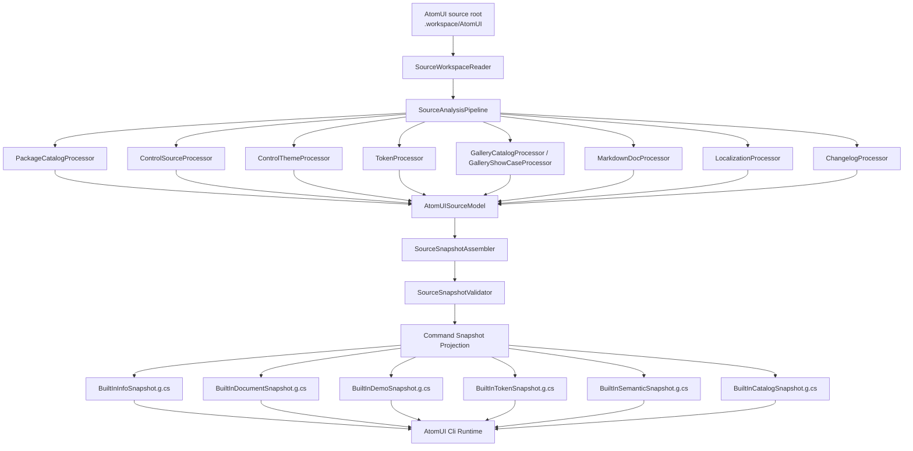

# Source Analysis Pipeline 架构设计

## 1. 文档定位

本文档定义 AtomUI Cli 的统一构建期 Source Analysis Pipeline。它是 AtomUI Cli 所有源码事实类数据的底层生产管线，负责在构建期读取 AtomUI 源码、Gallery、控件文档、ControlTheme、Token 定义和产品项目，生成运行时命令可直接消费的版本化快照。

本文档不描述具体工程目录拆分、开发任务拆分或发布流水线步骤。工程实施计划放在 `docs/superpowers/plans/` 下维护。

## 2. 背景与问题

AtomUI Cli 的多个命令都需要准确的 AtomUI 源码事实：

- `info` 需要控件 API、事件、继承关系、TemplatePart、PseudoClasses、Token 摘要和示例。
- `doc` 需要完整控件文档、API surface、逻辑结构、ControlTheme 结构、示例、Token 和 semantic parts。
- `demo` 需要 Gallery 示例、SourceKey、示例分类、源码片段和来源行号。
- `token` 需要共享 Token、控件 Token、依赖链、资源键和 ControlTheme 使用点。
- `semantic` 需要 TemplatePart、伪类、NameScope 依赖、模板命名节点、selector、TemplateBinding、Token 使用点和可定制边界。
- `package`、`list`、`changelog` 需要产品、包、控件分类和版本变更事实。

当前实现存在两个明显风险：

- 部分命令仍然依赖手写 snapshot，例如 `semantic` 当前只输出少量 `MetadataSnapshot.SemanticParts`，无法覆盖真实源码和主题结构。
- `token` 已经有构建期抽取器，但它是 token 专用抽取器。如果继续让每个命令自建抽取器，会导致重复解析源码、数据冲突、诊断标准不一致和商业控件边界难以统一。

因此需要把源码分析上升为全局 Pipeline：所有需要源码事实的命令都从统一构建期 Pipeline 获取信息，命令层只消费生成后的 snapshot，不直接解析源码。

## 3. 架构目标

- 统一构建期源码分析入口，避免 `info`、`doc`、`demo`、`token`、`semantic` 各自为战。
- 保持 AOT-first：运行时不扫描源码、不读取 Git、不反射 AtomUI 控件程序集、不动态解析 AXAML。
- 让每个命令通过声明式方式挂载所需信息处理器，而不是在 handler 或 query service 中拼接数据。
- 生成可追溯、可校验、可版本化的 Source Analysis Snapshot。
- 支持 AtomUI 核心控件、扩展控件和商业控件项目。
- 支持命令投影：同一份源码事实可以投影为 `info`、`doc`、`demo`、`token`、`semantic` 等不同运行时快照。
- 统一诊断：源码缺失、文档冲突、TemplatePart 不一致、Token 使用点断裂等问题由 Pipeline 统一记录。
- 统一源码身份：所有快照共享 `sourceRef`、`sourceCommit`、`targetVersion` 和相对源码路径。

## 4. 非目标

- 不在 CLI 运行时读取 AtomUI 源码目录。
- 不在 CLI 运行时加载 AtomUI 控件程序集或用户项目程序集。
- 不执行 Gallery 或控件源码中的任意业务代码。
- 不通过控件名称生成猜测性 API、Token、semantic parts 或模板结构。
- 不把命令输出模型作为源码事实模型。
- 不把商业控件 internal/private API 泄漏到公开快照。
- 不让命令 handler 直接依赖构建期 adapter。

## 5. 总体架构



Pipeline 的关键边界：

- 构建期：读取源码、解析文件、生成中间模型、校验、生成快照代码或压缩快照。
- 运行时：只加载生成后的快照，通过 query service 查询，通过 renderer 输出。
- 命令层：声明自己需要哪些快照，不拥有源码分析逻辑。

## 6. 源码根与身份

源码根解析优先级统一为：

1. MSBuild 属性或命令行参数 `AtomUISourceRoot` / `--source-root`。
2. 环境变量 `ATOMUI_SOURCE_ROOT`。
3. 默认路径 `<AtomUICliRepoRoot>/.workspace/AtomUI`。

Pipeline 本身不负责 clone、pull 或 checkout AtomUI 源码。源码供应属于 Pipeline 之前的构建期步骤：默认要求 `.workspace/AtomUI` 已存在；只有显式设置 `AtomUIAutoProvisionSource=true` 时，构建系统才允许在源码目录不存在的情况下 clone AtomUI 仓库。

### 6.1 构建期源码供应

源码供应由 `EnsureAtomUISource` 构建目标负责，必须在 `GenerateBuiltInSourceAnalysisSnapshots` 之前执行。

构建目标顺序：

```text
EnsureAtomUISource
  -> ValidateAtomUISourceIdentity
  -> GenerateBuiltInSourceAnalysisSnapshots
```

`EnsureAtomUISource` 只负责让源码目录存在；`ValidateAtomUISourceIdentity` 负责确认实际源码身份；`GenerateBuiltInSourceAnalysisSnapshots` 只消费已校验源码，不承担网络、clone 或 checkout 职责。

构建属性：

| 属性 | 默认值 | 说明 |
| --- | --- | --- |
| `AtomUIAutoProvisionSource` | `false` | 是否允许构建期自动 clone AtomUI 源码。默认禁止联网。 |
| `AtomUISourceRepository` | `https://github.com/AtomUI/AtomUI.git` | 自动 clone 使用的 Git 仓库地址。私有镜像或企业 GitHub 可覆盖。 |
| `AtomUISourceRef` | `release/6.0` | 自动 clone 使用的 branch、tag 或 ref。不能替代 commit 锁定。 |
| `AtomUISourceCommit` | 空 | 可选的源码 commit 锁。可以是完整 SHA 或 Git 可解析的 commit 引用。Release 构建必须设置。 |
| `AtomUISourceRoot` | `<AtomUICliRepoRoot>/.workspace/AtomUI` | AtomUI 源码目录。显式配置时优先级最高。 |

建议 MSBuild 默认值：

```xml
<AtomUIAutoProvisionSource>false</AtomUIAutoProvisionSource>
<AtomUISourceRepository>https://github.com/AtomUI/AtomUI.git</AtomUISourceRepository>
<AtomUISourceRef>release/6.0</AtomUISourceRef>
<AtomUISourceCommit></AtomUISourceCommit>
<AtomUISourceRoot>$(AtomUICliRepoRoot).workspace/AtomUI</AtomUISourceRoot>
```

执行规则：

1. 如果 `AtomUISourceRoot` 已存在，直接进入源码身份校验，不执行网络操作。
2. 如果 `AtomUISourceRoot` 不存在且 `AtomUIAutoProvisionSource` 不是 `true`，构建失败，提示用户 clone 到 `.workspace/AtomUI` 或显式配置源码根。
3. 如果 `AtomUISourceRoot` 不存在且 `AtomUIAutoProvisionSource=true`，构建系统执行 `git clone --branch $(AtomUISourceRef) $(AtomUISourceRepository) $(AtomUISourceRoot)`。
4. 如果设置了 `AtomUISourceCommit`，clone 后必须 checkout 到该 commit，并校验解析后的 `git rev-parse HEAD` 与锁定 commit 一致。
5. 自动供应不得对已有源码目录执行隐式 `git pull`，避免本地和 CI 构建结果漂移。

失败策略：

| 场景 | 行为 |
| --- | --- |
| `git` 不存在 | 如果需要自动供应，构建失败，提示安装 Git 或手动准备 `.workspace/AtomUI`。 |
| 网络不可用 | 构建失败，不降级为手写快照或旧数据。 |
| 仓库 clone 失败 | 构建失败并输出 repository、ref 和 target path。 |
| `AtomUISourceCommit` 校验失败 | 构建失败，输出期望 commit、解析后的期望 commit 与实际 commit。 |
| `.workspace/AtomUI` 已存在但 ref 不匹配 | 不自动切换；构建失败或 warning 由 `AtomUISourceCommit` 是否设置决定。Release 构建必须失败。 |
| `.workspace/AtomUI` 不是 Git 仓库 | 允许非 release 本地构建继续生成快照，但 `sourceCommit` 记录为 `unknown`；Release 构建必须失败。 |

CI/CD 推荐写法：

```bash
dotnet build \
  -p:AtomUIAutoProvisionSource=true \
  -p:AtomUISourceRepository=https://github.com/AtomUI/AtomUI.git \
  -p:AtomUISourceRef=release/6.0 \
  -p:AtomUISourceCommit=<locked-sha>
```

Release 构建必须设置 `AtomUISourceCommit`。未锁定 commit 的自动供应只能用于本地开发、预览构建或临时验证，不得作为正式发布依据。

日志与快照要求：

- 构建日志必须输出最终 `AtomUISourceRoot`、`AtomUISourceRepository`、`AtomUISourceRef` 和实际 `sourceCommit`。
- 生成快照必须继续使用逻辑路径 `.workspace/AtomUI`，不得写入本机绝对路径。
- 如果通过显式 `AtomUISourceRoot` 指向其他目录，快照仍记录逻辑 `sourceRootConvention`，具体绝对路径只能出现在构建日志中。
- MetadataBuilder 接收的 `--source-root` 必须是校验后的最终路径。

每次 Pipeline 产出必须记录：

| 字段 | 说明 |
| --- | --- |
| `sourceRootConvention` | 默认约定路径，例如 `.workspace/AtomUI`。 |
| `sourceRef` | release line、branch 或 tag，例如 `release/6.0`。 |
| `sourceCommit` | AtomUI 源码仓库 HEAD 短 commit。 |
| `targetVersion` | AtomUI 目标版本。 |
| `snapshotSchemaVersion` | Source Analysis Snapshot schema。 |
| `generatedAt` | 构建时间，仅用于诊断，不参与稳定排序。 |

生成结果不得写入本机绝对源码路径，只能写入相对源码路径。

## 7. Pipeline 生命周期

```text
ResolveSourceRoot
  -> ReadSourceWorkspace
  -> RegisterProcessors
  -> PlanFeatureGraph
  -> ExecuteProcessors
  -> AssembleSourceModel
  -> ValidateSourceModel
  -> ProjectCommandSnapshots
  -> ValidateCommandSnapshots
  -> WriteGeneratedArtifacts
```

| 阶段 | 职责 | 失败策略 |
| --- | --- | --- |
| `ResolveSourceRoot` | 解析源码根和源码身份。 | 核心源码根不存在时失败。 |
| `ReadSourceWorkspace` | 读取 solution、项目、版本文件和基础路径索引。 | solution 缺失按 error，扩展输入缺失按 warning。 |
| `RegisterProcessors` | 注册构建期信息获取处理器。 | 重复 processor id 失败。 |
| `PlanFeatureGraph` | 根据命令和投影需求计算 processor 执行图。 | 依赖缺失失败。 |
| `ExecuteProcessors` | 执行 processor，产出 source facts。 | processor error 按配置决定失败或继续。 |
| `AssembleSourceModel` | 合并 facts，形成统一 `AtomUISourceModel`。 | 冲突进入 diagnostics。 |
| `ValidateSourceModel` | 校验引用完整性、商业边界、schema。 | release 构建 error 级诊断失败。 |
| `ProjectCommandSnapshots` | 投影为各命令运行时快照。 | 投影缺字段失败。 |
| `ValidateCommandSnapshots` | 校验命令快照独立可用。 | 必需命令快照不完整失败。 |
| `WriteGeneratedArtifacts` | 写入 `.g.cs` 或压缩 JSON。 | 写入失败直接失败。 |

## 8. 处理器挂载模型

Pipeline 通过 `ISourceAnalysisProcessor` 统一挂载信息获取处理器。处理器只在构建期运行，不进入 CLI 运行时 DI 容器。

```csharp
public interface ISourceAnalysisProcessor
{
    string Id { get; }
    IReadOnlySet<SourceAnalysisFeature> Provides { get; }
    IReadOnlySet<SourceAnalysisFeature> Requires { get; }
    SourceAnalysisPhase Phase { get; }

    ValueTask ExecuteAsync(
        SourceAnalysisContext context,
        CancellationToken cancellationToken);
}
```

核心约束：

- `Provides` 声明处理器产出的事实能力，例如 `ControlApi`、`ControlTheme`、`TokenGraph`。
- `Requires` 声明处理器依赖的事实能力，例如 `ControlThemeSemanticProcessor` 依赖 `ControlTheme` 和 `ControlApi`。
- `Phase` 控制执行阶段，避免 token 依赖、theme 依赖和 command projection 混在一起。
- `ExecuteAsync` 只能向 `SourceAnalysisContext` 写入中间 facts 和 diagnostics，不能直接写最终命令快照。

### 8.1 Feature 定义

```csharp
public enum SourceAnalysisFeature
{
    Workspace,
    ProductCatalog,
    ControlCatalog,
    ControlApi,
    AvaloniaProperty,
    EventContract,
    LifecycleContract,
    TemplatePart,
    PseudoClass,
    ControlTheme,
    ThemeVisualTree,
    ThemeSelector,
    TemplateBinding,
    TokenDefinition,
    TokenGraph,
    TokenUsage,
    GalleryNavigation,
    GalleryDemo,
    Localization,
    MarkdownDoc,
    Changelog,
    SemanticContract,
    CommercialVisibility
}
```

命令不直接依赖 processor 类型，而是声明所需 feature：

| 命令 | 所需 feature |
| --- | --- |
| `list` | `ProductCatalog`、`ControlCatalog`、`GalleryNavigation`。 |
| `info` | `ControlCatalog`、`ControlApi`、`EventContract`、`TemplatePart`、`PseudoClass`、`TokenDefinition`、`GalleryDemo`。 |
| `doc` | `ControlApi`、`EventContract`、`LifecycleContract`、`ControlTheme`、`ThemeVisualTree`、`TemplateBinding`、`TokenGraph`、`GalleryDemo`、`MarkdownDoc`、`SemanticContract`。 |
| `demo` | `GalleryDemo`、`Localization`、`ControlCatalog`。 |
| `token` | `TokenDefinition`、`TokenGraph`、`TokenUsage`、`ControlTheme`。 |
| `semantic` | `TemplatePart`、`PseudoClass`、`ControlTheme`、`ThemeVisualTree`、`ThemeSelector`、`TemplateBinding`、`TokenUsage`、`SemanticContract`。 |
| `package` | `PackageCatalog`、`ProductCatalog`、`ControlCatalog`、`CommercialVisibility`。 |
| `changelog` | `Changelog`、`ControlCatalog`、`ProductCatalog`。 |

### 8.2 Processor Registry

```csharp
public sealed class SourceAnalysisProcessorRegistry
{
    public void Add<TProcessor>() where TProcessor : ISourceAnalysisProcessor;
    public SourceAnalysisPlan CreatePlan(IReadOnlySet<SourceAnalysisFeature> requiredFeatures);
}
```

Registry 规则：

- processor id 必须全局唯一。
- 一个 feature 可以由多个 processor 提供，但必须通过 priority 和 merge policy 定义合并顺序。
- 如果多个 processor 对同一个事实字段给出冲突值，不能静默覆盖，必须进入 diagnostics。
- 商业控件 processor 可以注册在同一 Pipeline，但输出必须经过 `CommercialVisibilityProcessor` 过滤。

## 9. SourceAnalysisContext

`SourceAnalysisContext` 是构建期共享上下文，承载输入、事实存储、诊断和缓存。

```csharp
public sealed class SourceAnalysisContext
{
    public SourceIdentity SourceIdentity { get; }
    public SourcePathIndex Paths { get; }
    public SourceFactStore Facts { get; }
    public SourceDiagnosticBag Diagnostics { get; }
    public SourceAnalysisCache Cache { get; }
}
```

### 9.1 Fact Store

Fact Store 按稳定 key 保存 processor 产物：

```text
control:Button
control-api:Button
control-theme:Button:ButtonTheme
theme-node:Button:PART_LoadingIcon
pseudo-class:Button::loading
token:Button:Padding
demo:Button:button-loading
doc:Button:overview
```

Fact Store 要求：

- key 使用 ordinal ignore case 查询，写入时保留原始大小写。
- 每个 fact 记录 `sourcePath`、`sourceLine`、`sourceKind` 和 processor id。
- 同一个 key 可以有多个 source contribution。
- 最终合并由 assembler 决定，processor 不直接覆盖最终值。

### 9.2 Diagnostics

诊断数据结构：

```csharp
public sealed record SourceDiagnostic(
    string Code,
    string Severity,
    string Message,
    string? SourcePath,
    int? SourceLine,
    string? TargetKind,
    string? TargetId,
    string ProcessorId);
```

诊断原则：

- 抽取失败但可降级的情况输出 warning。
- 引用断裂、公开数据冲突、release 构建缺失核心输入输出 error。
- 不能为了让命令输出好看而吞掉诊断。
- command snapshot 必须保留与自身相关的 diagnostics。

## 10. 中间模型

统一事实模型命名为 `AtomUISourceModel`，它是命令快照的上游，不直接暴露给 CLI 运行时命令。

```csharp
public sealed record AtomUISourceModel(
    SourceIdentity Source,
    IReadOnlyList<ProductSourceModel> Products,
    IReadOnlyList<PackageSourceModel> Packages,
    IReadOnlyList<ControlSourceModel> Controls,
    IReadOnlyList<ControlThemeSourceModel> ControlThemes,
    IReadOnlyList<TokenSourceModel> Tokens,
    IReadOnlyList<GalleryDemoSourceModel> Demos,
    IReadOnlyList<MarkdownDocSourceModel> Documents,
    IReadOnlyList<ChangelogSourceModel> Changelog,
    IReadOnlyList<SourceDiagnostic> Diagnostics);
```

### 10.1 ControlSourceModel

```csharp
public sealed record ControlSourceModel(
    string Name,
    string FullTypeName,
    string Namespace,
    string PackageId,
    string ProductId,
    string CategoryId,
    bool IsCommercial,
    string? BaseType,
    IReadOnlyList<string> Interfaces,
    IReadOnlyList<ApiMemberSourceModel> ApiMembers,
    IReadOnlyList<EventSourceModel> Events,
    IReadOnlyList<LifecycleSourceModel> Lifecycle,
    IReadOnlyList<TemplatePartSourceModel> TemplateParts,
    IReadOnlyList<PseudoClassSourceModel> PseudoClasses,
    IReadOnlyList<SourceLocation> Sources);
```

### 10.2 ControlThemeSourceModel

```csharp
public sealed record ControlThemeSourceModel(
    string ControlName,
    string ThemeName,
    string TargetType,
    IReadOnlyList<ThemeTemplateSourceModel> Templates,
    IReadOnlyList<ThemeSelectorSourceModel> Selectors,
    IReadOnlyList<ThemeTokenUsageSourceModel> TokenUsages,
    SourceLocation Source);
```

模板结构必须保留真实 tree：

```csharp
public sealed record ThemeVisualNodeSourceModel(
    string NodeId,
    string TypeName,
    string? Name,
    string? ParentNodeId,
    IReadOnlyList<TemplateBindingSourceModel> TemplateBindings,
    IReadOnlyList<string> AppliedSelectors,
    SourceLocation Source);
```

### 10.3 SemanticContractSourceModel

Semantic contract 不等同于命名节点列表。它是 C# 契约、AXAML 真实结构和文档解释合并后的结果。

```csharp
public sealed record SemanticContractSourceModel(
    string ControlName,
    IReadOnlyList<SemanticPartSourceModel> Parts,
    IReadOnlyList<PseudoClassSourceModel> PseudoClasses,
    IReadOnlyList<SemanticStateFlowSourceModel> StateFlows,
    IReadOnlyList<SemanticDiagnosticSourceModel> Diagnostics);
```

```csharp
public sealed record SemanticPartSourceModel(
    string Name,
    string Kind,
    string? NodeType,
    string Stability,
    string Responsibility,
    IReadOnlyList<string> RelatedApis,
    IReadOnlyList<string> RelatedTokens,
    IReadOnlyList<string> RelatedPseudoClasses,
    IReadOnlyList<string> Selectors,
    IReadOnlyList<SourceContribution> Sources);
```

Semantic part 的 `Sources` 至少区分：

| Source kind | 说明 |
| --- | --- |
| `template-part-attribute` | C# `[TemplatePart]` 声明。 |
| `name-scope-lookup` | C# `NameScope.Find/Get` 实际依赖。 |
| `theme-named-node` | AXAML 模板中的命名节点。 |
| `theme-selector` | AXAML `/template/ #part` selector 使用。 |
| `document-description` | 控件文档提供的职责说明。 |

## 11. Processor 设计

### 11.1 SourceWorkspaceProcessor

职责：

- 解析 `.slnx`、`.sln`。
- 读取 `build/Version.props`、`Directory.Packages.props`。
- 建立项目路径、源码文件路径和 logical path 索引。
- 解析 source commit 和 source ref。

不执行：

- 不 restore NuGet。
- 不执行 MSBuild target。
- 不编译 AtomUI 项目。

### 11.2 ProductProjectProcessor

职责：

- 从 `.csproj` 推断 packageId、productId、是否 optional、是否 commercial。
- 建立控件类型到 package 的归属关系。
- 支持 `metadata.config.json` 对产品显示名、商业边界、可见性进行覆盖。

### 11.3 ControlSourceProcessor

职责：

- 使用 Roslyn syntax tree 提取控件 C# 源码事实。
- 提取 public/protected API、Avalonia property、事件、显式接口、继承关系、生命周期方法。
- 提取 `[TemplatePart]`、`[PseudoClasses]`。
- 提取 `OnApplyTemplate` 中的 `NameScope.Find/Get`、`FindControl`。
- 提取 `PseudoClasses.Set` 与属性/状态条件之间的关系。

关键规则：

- 不加载程序集。
- 不运行源码。
- GeneratedFiles 默认跳过。
- internal 成员默认不进入公开快照，除非 semantic/theme 需要并标注为 `implementation-detail`。

### 11.4 ControlThemeProcessor

职责：

- 使用 XML parser 解析 `.axaml`，保留行号和父子层级。
- 提取 `ControlTheme.TargetType`、`x:Key`、`BasedOn`。
- 提取 `Setter Property="Template"` 下的 `ControlTemplate`。
- 提取模板视觉树、命名节点、`TemplateBinding`。
- 提取 `Style Selector` 层级和 `/template/` selector。
- 提取 pseudo class selector，例如 `:disabled`、`:pointerover`、`:pressed`、`:focus-visible`、`:loading`。
- 提取 TokenResource 使用点。

关键规则：

- 不能把命名节点列表当成模板结构，必须保留 tree。
- 多个模板变体必须分别输出。
- C# theme class 可以作为 theme identity 补充，但不能替代 AXAML 事实。

### 11.5 SemanticContractProcessor

职责：

- 合并 `ControlSourceProcessor` 和 `ControlThemeProcessor` 的事实。
- 把 TemplatePart、NameScope lookup、AXAML 命名节点、selector 和文档说明合并为 semantic parts。
- 给每个 part 标注稳定性和来源。
- 建立 part 与 API、Token、pseudo class 的关系。

合并规则：

| 情况 | 处理 |
| --- | --- |
| C# `[TemplatePart]` 存在，AXAML 找到同名节点 | `stable`。 |
| C# `NameScope.Find` 存在，AXAML 找到同名节点 | `stable` 或 `runtime-required`。 |
| AXAML 有 `PART_*`，C# 无声明也无 lookup | `theme-public` 或 `theme-internal`，由文档/config 决定。 |
| C# 声明了 TemplatePart，AXAML 缺失 | error。 |
| C# 查找了节点，AXAML 缺失 | error。 |
| AXAML selector 使用了不存在的 named node | error。 |
| pseudo class 出现在 selector 但源码没有声明或设置 | warning，可能继承自 Avalonia 基类时标注 `inherited`。 |

### 11.6 TokenProcessor

职责：

- 提取 shared token、control token、Token kind、资源键、XML summary。
- 分析 `CalculateTokenValues` 的依赖链。
- 提取 ControlTheme 中 TokenResource 使用点。

当前 `TokenSourceExtractor` 应迁移为该 processor，并复用 `ControlThemeProcessor` 的 AXAML 解析结果，不再自己重复扫描所有 theme 文件。

### 11.7 PackageCatalogProcessor

职责：

- 读取 `src/AtomUI.Desktop.Controls*.csproj` 中的控件生态包项目。
- 读取 `build/Version.props` 中的 `AtomUIVersion`，作为 package version。
- 读取 `Directory.Packages.props` 和 build props，解析 `PackageReference`、`ProjectReference` 以及 MSBuild 属性版本。
- 从 Gallery 控件事实反推 package 和 product 的控件归属。
- 从 `docs/modules/**/overview.md` 提取 package/product 说明文本。
- 生成 package 依赖、注册入口、target frameworks、compatibility、source files 和 diagnostics。
- 标注 optional package 和 commercial package 可见性。

规则：

- 不能在运行时 `MetadataCatalog.CreateFallback` 中维护真实包清单。
- 没有控件归属的项目不进入命令 catalog，避免把内部工具包误暴露为控件包。
- package description 必须来自源码文档；源码文档缺失时只能输出通用 package 说明并记录诊断。
- 商业包只公开产品级事实，不泄漏 internal/private API。

### 11.8 GalleryCatalogProcessor

职责：

- 提取 Gallery 导航、分类、控件 route。
- 从 Gallery 导航输出 `category:*` 和 `control:*` facts。
- 从 AtomUI LLMS 控件源文档抽取控件简介。

规则：

- 只负责控件目录和 Gallery 导航，不生成 product/package、design topic 或 changelog。
- 不保留 `Button`、`DataGrid` 等手写兜底说明；控件说明优先来自 `docs/AI/llms/controls/<control>/index-cn.md`。

### 11.9 GalleryShowCaseProcessor

职责：

- 提取 Gallery 示例、SourceKey、标题、描述、分类、AXAML 片段和代码片段。
- 提取 localization 文案。

Gallery 示例是 `demo`、`doc examples`、`info demos` 的共同事实源。

### 11.10 MarkdownDocProcessor

职责：

- 读取控件文档中的人工解释、行为边界、维护不变量、兼容性说明。
- 优先读取 `DESIGN.md`、`docs/design.md` 或 `docs/design-language.md` 作为专用设计语言文档。
- 源码未提供专用设计语言文档时，读取 `docs/overview.md`、`docs/controls/overview.md`、控件研发规范、控件文档规范、Token 规范和 Gallery 示例规范。
- 生成 `topic/design-language` 文档事实，供 `design.md` 和 `doc --topic design-language` 共同消费。
- 校验文档引用的源码路径存在。
- 为 API、semantic part、Token 提供 description override 和 recommendation。

规则：

- Markdown 不能发明源码不存在的 API 或主题节点。
- Markdown 可以提供职责说明、稳定性、推荐等级和场景解释。
- Markdown 与源码冲突时输出 diagnostic。

### 11.11 ChangelogProcessor

职责：

- 读取源码根目录 `CHANGELOG.md`。
- 按版本块解析 release 条目、分组条目和嵌套 bullet。
- 生成 release 级 changelog facts。
- 根据 catalog 控件名补充 control 级 changelog facts，支持 `changelog --control <control>`。

规则：

- `CHANGELOG.md` 缺失时输出 warning 和空 changelog，不生成伪条目。
- message 必须来自源码 changelog 文本，只允许做术语清洗和空白归一化。
- 版本排序以 changelog 中的 semantic version 为准。

## 12. Snapshot Assembler

Assembler 负责把多个 processor 的 facts 合并为 `AtomUISourceModel`。

合并优先级：

1. 显式 `metadata.config.json`。
2. 源码结构化事实，包括 C# API、TemplatePart、PseudoClasses、NameScope lookup。
3. ControlTheme 真实模板结构、selector、TemplateBinding、Token 使用点。
4. Token 定义和 Token 计算依赖。
5. Gallery 导航和示例。
6. Markdown 文档的解释、说明和推荐等级。
7. Changelog。

说明：

- 优先级决定字段冲突时的权威来源，不代表低优先级信息被丢弃。
- 所有来源必须作为 `SourceContribution` 保留，便于命令输出 `--source` 和诊断。
- 文档说明可以覆盖 description，但不能覆盖源码类型、节点存在性、事件类型或 Token 依赖。

## 13. 命令快照投影

统一 Source Model 不直接给运行时命令使用。Pipeline 在构建期按命令投影运行时快照：

| 快照 | 消费命令 | 来源 |
| --- | --- | --- |
| `CatalogSnapshot` | `list`、`help` 摘要、`design.md`、`changelog` | 产品、包摘要、控件、Gallery 分类、源码文档 topic、CHANGELOG 条目。 |
| `PackageSnapshot` | `package` | 产品、NuGet 包、包依赖、注册入口、兼容性、冲突关系、替代关系和包内控件清单。 |
| `InfoSnapshot` | `info` | 控件 API、事件、Token 摘要、semantic 摘要、示例摘要。 |
| `DocumentSnapshot` | `doc` | 控件文档、API、逻辑结构、ControlTheme、示例、Token、semantic。 |
| `DemoSnapshot` | `demo` | Gallery 示例、代码片段、场景分类、来源。 |
| `TokenSnapshot` | `token` | Token 定义、依赖、资源键、theme usage。 |
| `SemanticSnapshot` | `semantic` | semantic parts、pseudo classes、template tree、selector、API/Token 关系。 |
| `ChangelogSnapshot` | `changelog` | changelog 和 target 解析。 |

命令 query service 只能依赖对应 snapshot registry：

```text
SemanticCommandHandler
  -> SemanticQueryService
      -> SemanticSnapshotRegistry
          -> BuiltInSemanticSnapshotFactory.Create()
```

禁止：

- `SemanticCommandHandler` 读取 `MetadataSnapshot.SemanticParts` 手写列表。
- `DocCommandHandler` 自己维护一份 Button semantic parts。
- `TokenQueryService` 为缺失 Token 在运行时补数据。
- `InfoCommandHandler` 从 doc markdown 中反向解析 API 表。
- `MetadataCatalog.CreateFallback` 保存真实控件、包、文档、demo、semantic 或 changelog 事实。

## 14. SemanticSnapshot 设计

`semantic` 命令需要独立快照，不能依附 doc 文档快照。

```csharp
public sealed record SemanticSnapshot(
    string SchemaVersion,
    string SnapshotId,
    string TargetVersion,
    SourceIdentityDocument Source,
    IReadOnlyList<SemanticControlDocument> Controls,
    IReadOnlyList<SourceDiagnosticDocument> Diagnostics);
```

```csharp
public sealed record SemanticControlDocument(
    string Name,
    string PackageId,
    string ProductId,
    bool IsCommercial,
    IReadOnlyList<SemanticPartDocument> Parts,
    IReadOnlyList<PseudoClassDocument> PseudoClasses,
    IReadOnlyList<ThemeTemplateDocument> Templates,
    IReadOnlyList<ThemeSelectorDocument> Selectors,
    IReadOnlyList<SemanticStateFlowDocument> StateFlows,
    IReadOnlyList<RelatedCommandDocument> Related);
```

```csharp
public sealed record SemanticPartDocument(
    string Name,
    string Kind,
    string? NodeType,
    string Stability,
    string Responsibility,
    IReadOnlyList<string> RelatedApis,
    IReadOnlyList<string> RelatedTokens,
    IReadOnlyList<string> RelatedPseudoClasses,
    IReadOnlyList<string> Selectors,
    IReadOnlyList<SourceContributionDocument> Sources);
```

`Kind` 取值：

| Kind | 说明 |
| --- | --- |
| `template-part` | C# TemplatePart 或 NameScope 依赖确认的模板契约。 |
| `named-node` | AXAML 真实命名节点，但不一定是公开模板契约。 |
| `pseudo-class` | 伪类状态。 |
| `template-selector` | 主要通过 selector 暴露的可样式化目标。 |
| `state-flow` | API 或内部状态驱动的视觉状态。 |

`Stability` 取值：

| Stability | 说明 |
| --- | --- |
| `stable` | 推荐作为公开定制或 Agent 生成入口。 |
| `runtime-required` | 控件代码依赖该节点，变更风险高。 |
| `theme-public` | 主题可样式化节点，文档或 config 标记为公开。 |
| `theme-internal` | 主题内部节点，不建议用户依赖。 |
| `implementation-detail` | 内部实现细节，只在 `--detail` 或 diagnostics 中出现。 |
| `inherited` | 来自 Avalonia 或基类的状态/节点约定。 |

## 15. semantic 命令输出能力

`dotnet atomui semantic Button` 默认输出：

- 控件名、包、产品。
- stable/template-public semantic parts。
- 每个 part 的节点类型、职责、相关 API、相关 Token。
- pseudo classes 列表。
- 相关命令，例如 `doc Button --section theme`、`token Button --usage`。

`--part <name>` 输出单个 part：

- part 来源：TemplatePart、NameScope.Find、theme named node、selector、document。
- 相关 selectors。
- TemplateBinding 映射。
- Token usage。
- 状态触发条件。

`--include-template` 输出模板摘要：

- template variant。
- visual tree 摘要。
- named node 层级。
- selector groups。
- 不输出完整 AXAML 源码。

`--format json` 输出完整结构化 payload。

## 16. 构建产物策略

首期保持 C# 生成文件策略，符合当前 `BuiltInTokenSnapshot.g.cs` 落地方式：

```text
output/obj/AtomUI.Cli.Hosting/Generated/Metadata/
  BuiltInCatalogSnapshot.g.cs
  BuiltInInfoSnapshot.g.cs
  BuiltInDocumentSnapshot.g.cs
  BuiltInDemoSnapshot.g.cs
  BuiltInTokenSnapshot.g.cs
  BuiltInSemanticSnapshot.g.cs
  BuiltInPackageSnapshot.g.cs
  BuiltInChangelogSnapshot.g.cs
```

后续如果 snapshot 体积过大，可以切换为压缩 JSON 资源：

```text
output/obj/AtomUI.Cli.Hosting/Generated/Metadata/
  metadata.v6.json.gz
  metadata.index.g.cs
```

切换规则：

- 对运行时命令透明，registry 接口不变。
- AOT JSON source generation 必须覆盖 DTO。
- 不允许运行时读取源码目录作为 fallback。
- 运行时 fallback 只能是空快照，用于极端生成产物缺失时保持类型可构造；它不得包含真实 AtomUI 控件事实。

## 17. MSBuild 集成

`AtomUI.Cli.Hosting.csproj` 挂载统一 target：

```text
GenerateBuiltInSourceAnalysisSnapshots
  BeforeTargets="CoreCompile"
  Inputs:
    AtomUISourceRoot
    AtomUITargetVersion
    AtomUISourceRef
    AtomUISourceCommitLock
  Outputs:
    output/obj/AtomUI.Cli.Hosting/Generated/Metadata/*.g.cs
```

target 职责：

- 调用 `tools/AtomUI.Cli.MetadataBuilder`。
- 传入统一源码根和目标版本。
- 生成所有内置 snapshot。
- 任一必需 snapshot 生成失败时，`AtomUI.Cli.Hosting` 编译失败。

命令参数示例：

```bash
dotnet run --project tools/AtomUI.Cli.MetadataBuilder \
  --source-root .workspace/AtomUI \
  --target-version 6.0 \
  --source-ref release/6.0 \
  --output-root output/obj/AtomUI.Cli.Hosting/Generated/Metadata
```

## 18. 增量构建与缓存

Pipeline 支持 processor 级缓存，但缓存不能影响正确性。

缓存 key 至少包含：

- processor id。
- source commit。
- processor version。
- 输入文件相对路径和 hash。
- target version。
- metadata config hash。

缓存规则：

- release 构建可以禁用缓存。
- processor 输入 hash 变化必须重新执行。
- 缓存文件只放在 `output/obj` 或构建临时目录，不写入源码树。
- diagnostics 也必须参与缓存结果。

## 19. 商业控件边界

统一 Pipeline 支持商业控件，但必须通过 visibility 过滤：

| 场景 | 规则 |
| --- | --- |
| 公开 CLI 包 | 不包含商业 internal/private API、源码片段或内部模板节点。 |
| 商业授权数据包 | 可以包含商业控件公开 API、公开示例、公开 semantic parts 和公开 Token。 |
| 未授权用户查询商业控件 | 输出产品和授权提示，不输出受限内部数据。 |
| 商业控件源码缺失 | 对商业 feature 输出 warning 或 data unavailable，不影响公开控件快照。 |

商业边界由 `CommercialVisibilityProcessor` 和 `SnapshotValidator` 双重保证。

## 20. 诊断与错误标准

Pipeline 诊断码建议统一使用 `ATOMUICLI_SRC_*` 前缀：

| 诊断码 | 场景 | 默认级别 |
| --- | --- | --- |
| `ATOMUICLI_SRC_ROOT_MISSING` | 源码根不存在。 | error |
| `ATOMUICLI_SRC_COMMIT_MISMATCH` | release 构建 commit 与锁文件不一致。 | error |
| `ATOMUICLI_SRC_PROJECT_MISSING` | solution 声明项目不存在。 | error |
| `ATOMUICLI_SRC_CONTROL_DOC_CONFLICT` | 文档声明和源码事实冲突。 | warning/error |
| `ATOMUICLI_SRC_TEMPLATE_PART_MISSING` | C# TemplatePart 在主题中缺失。 | error |
| `ATOMUICLI_SRC_NAMESCOPE_PART_MISSING` | NameScope.Find 查找节点在主题中缺失。 | error |
| `ATOMUICLI_SRC_SELECTOR_TARGET_MISSING` | `/template/ #node` selector 指向不存在节点。 | error |
| `ATOMUICLI_SRC_PSEUDO_CLASS_UNRESOLVED` | selector 使用伪类但源码未声明或无法从继承解析。 | warning |
| `ATOMUICLI_SRC_TOKEN_USAGE_UNRESOLVED` | Theme 使用 TokenResource 但 Token 不存在。 | warning/error |
| `ATOMUICLI_SRC_DEMO_SOURCEKEY_MISSING` | Gallery 示例缺少 SourceKey。 | warning |
| `ATOMUICLI_SRC_COMMERCIAL_LEAK_RISK` | 商业内部数据将进入公开快照。 | error |

命令运行时错误码仍遵守 `docs/commands/error-code-standard.md`。构建期诊断和运行时错误码是两个层次，不能混用。

## 21. 测试策略

### 21.1 Processor 单元测试

每个 processor 必须有 focused tests：

- `ControlSourceProcessorTests`：StyledProperty、DirectProperty、RoutedEvent、TemplatePart、PseudoClasses、NameScope.Find。
- `ControlThemeProcessorTests`：ControlTheme target、template tree、named node、TemplateBinding、selector、TokenResource。
- `SemanticContractProcessorTests`：TemplatePart 与 AXAML 对齐、NameScope 依赖、pseudo class 关系、stability。
- `TokenProcessorTests`：Token 属性、XML summary、CalculateTokenValues 依赖、theme usage。
- `GalleryProcessorTests`：SourceKey、示例片段、scenario、localization。

### 21.2 Assembler 测试

- 文档 description 覆盖源码空描述。
- 文档声明不存在 API 时输出 warning 或 error。
- C# TemplatePart 和 AXAML 命名节点冲突时输出 error。
- 商业控件 internal 数据被过滤。

### 21.3 Command Snapshot 测试

- `semantic Button` 包含真实 `PART_LoadingIcon`、`:loading`、相关 API 和 Token。
- `doc Button --section theme` 与 `semantic Button --include-template` 使用同一 template facts。
- `token Button Padding --usage` 与 `semantic Button --part PART_ContentPresenter` 使用同一 theme source identity。
- `info Button` 的 API surface 与 `doc Button --section api` 一致。

### 21.4 端到端构建测试

- 默认源码根 `.workspace/AtomUI` 可生成所有内置 snapshot。
- 缺失源码根时构建失败，并提示配置 `AtomUISourceRoot` 或 `ATOMUI_SOURCE_ROOT`。
- release commit lock 不匹配时构建失败。
- 生成文件不包含本机绝对路径。

## 22. 迁移策略

### Phase 1: Pipeline 壳和 Token 迁移

- 引入 `SourceAnalysisPipeline`、`SourceAnalysisContext`、`SourceAnalysisProcessorRegistry`。
- 将现有 `TokenSourceExtractor` 拆为 `TokenProcessor` 和 `TokenSnapshotProjection`。
- 保持 `BuiltInTokenSnapshot.g.cs` 输出兼容当前 runtime。

### Phase 2: SemanticSnapshot

- 实现 `ControlSourceProcessor` 的 TemplatePart、PseudoClasses、NameScope.Find 抽取。
- 实现 `ControlThemeProcessor` 的 template tree、named node、selector 抽取。
- 实现 `SemanticContractProcessor`。
- 新增 `BuiltInSemanticSnapshot.g.cs`。
- 重构 `semantic` 命令，删除手写 `MetadataSnapshot.SemanticParts` 依赖。

### Phase 3: doc/info 对齐

- `doc` 的 API、theme、semantic、token、demo 数据改为读取统一 projections。
- `info` 改为读取 `InfoSnapshot`。
- 删除 `DocumentSnapshotRegistry` 中手写 Button semantic parts。

### Phase 4: Gallery 和商业控件

- Gallery 示例全量进入 `DemoSnapshot`。
- 商业控件通过同一 Pipeline 进入授权数据包或公开摘要。
- 引入 `CommercialVisibilityProcessor` 和 release validator。

## 23. 架构约束

- 所有源码事实只允许在构建期产生。
- 所有命令只允许读取运行时 snapshot registry。
- Pipeline processor 不允许引用 CLI command handler。
- Runtime query service 不允许补齐构建期遗漏字段。
- Renderer 不允许根据名称生成描述、职责、API、Token 或 semantic part。
- Snapshot DTO 必须显式建模并进入 JSON source generation。
- 所有 source path 必须是相对路径。
- 所有 diagnostics 必须可追溯到 processor id。

## 24. 与现有文档关系

- 本文档定义全局架构边界和 Pipeline 扩展点。
- `docs/modules/metadata/source-extraction-design.md` 继续维护 processor 的具体输入源、抽取规则和测试细节。
- `docs/commands/semantic/design.md` 定义 `semantic` 命令如何消费 `SemanticSnapshot`。
- `docs/commands/token/design.md` 定义 `token` 命令如何消费 `TokenSnapshot`。
- `docs/commands/doc/design.md` 定义 `doc` 命令如何消费 `DocumentSnapshot`。
